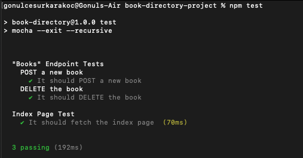

# Books Directory

Books Directory made with Node.js express library

**Version**: 0.0.0.1\
**Constituent**: Gönül Cesur Karakoç <gonul.karakoc@naylalabs.com>\
**Email**: gonul.karakoc@naylalabs.com

What you can do with this project?

### Books
- Create a books list.
- List the books.
- Update books' information.
- Remove the book from books directory.
- Sort books' information by published date
- Get the number of books of author
- Get published books between defined years

### Users
- Create an users list.
- List the users.
- Get user and books information received by user
- Update users' information.
- Remove the user from user list.

#### Dependencies
- **Node.js** (v16.13.0+)
- **npm** (v8.1.0)

#### Postman Document
Books -> https://documenter.getpostman.com/view/19000513/UVXjJb9S

Users -> https://documenter.getpostman.com/view/19000513/UVXonEKa

### Install & Run

```bash
# We download the repo.
git clone https://github.com/gonulkarakoc/books-directory-nodejs-project
cd books-directory-nodejs-project/

# We install dependencies packages.
# We start the application.
# http://127.0.0.1:3000/
nodemon app.js
```

### Test

```bash
# If you want to be tested.
npm test
```
<<<<<<< HEAD
=======


>>>>>>> 94f9cbe119dcf86567e1195f34b3a238213bcd41
